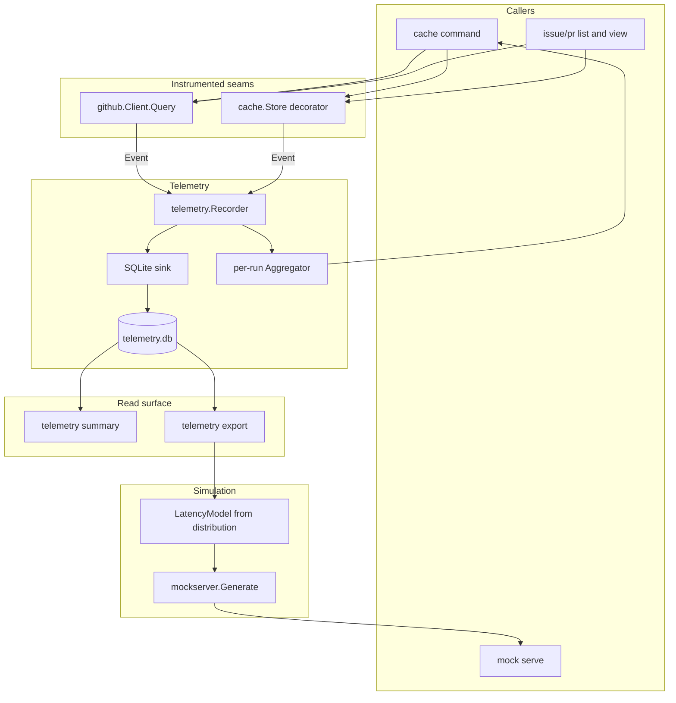
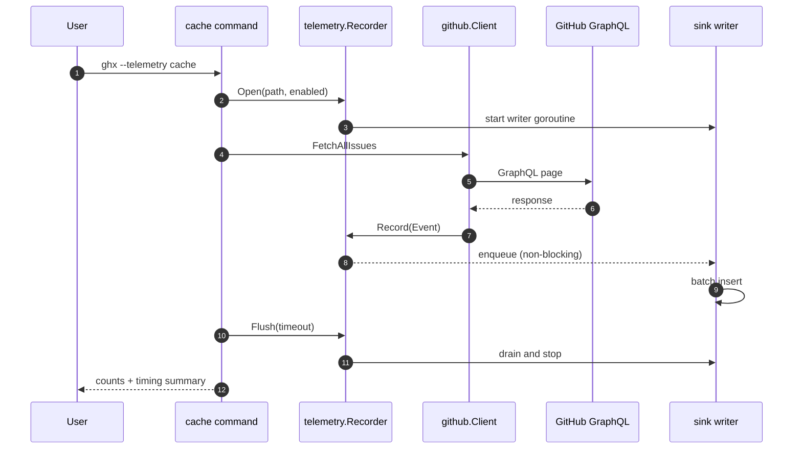
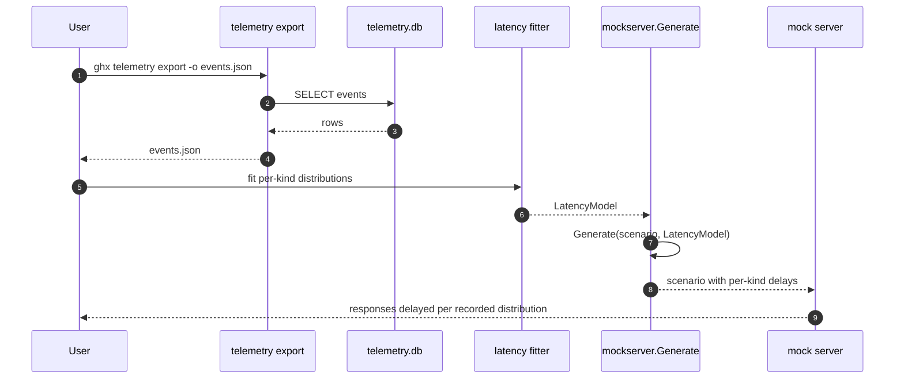

# Specification: Operational telemetry for API and cache performance

## Overview

The feature adds an event recorder to two existing seams and a reader surface on top of it.
GraphQL calls are instrumented inside `github.Client` (the single funnel at `internal/github/client.go:151`), cache operations are instrumented with a decorator over the `cache.Store` interface (`internal/cache/store.go:85`), and both emit `telemetry.Event` values to a SQLite sink that writes asynchronously.
The `cache` command reads a per-run summary from the same recorder, and a new `telemetry` command reads the database back for analysis.
The mock server's simulation generator gains an optional latency model whose parameters can be fitted from exported events, so generated scenarios reproduce measured per-kind latency instead of assumed latency.
Telemetry is disabled unless opted in, and every write failure is swallowed so instrumentation can never affect command behavior.

## Architecture



The recorder is a no-op implementation when telemetry is disabled, so seams call it unconditionally and the disabled path adds one interface call and no allocation.
When enabled, the recorder appends the encoded event to a bounded in-memory channel; a single background goroutine batches rows into the SQLite sink, so no caller ever blocks on disk I/O (NFR-1, NFR-2).
On command exit the recorder is flushed with a short bounded wait, after which pending events are dropped rather than delaying the command.

## Data Models

### `telemetry_event`

One row per instrumented call. Append-only; no updates or deletes except `telemetry clear`.

| Field | Type | Constraints | Description |
|---|---|---|---|
| id | INTEGER | PK, autoincrement | Monotonic row identity |
| timestamp | TEXT | not null | UTC RFC3339 with millisecond precision, when the call started |
| kind | TEXT | not null | Operation kind, e.g. `issue_full_fetch`, `pr_scan`, `pr_full_page`, `cache_query_issues` |
| operation | TEXT | not null | GraphQL operation or store method name, e.g. `fetch_all_issues`, `QueryIssues` |
| host | TEXT | nullable | API host (`github.com`, or the mock host) |
| repo | TEXT | nullable | `owner/repo` |
| status | INTEGER | nullable | HTTP status for API calls; null for cache operations |
| duration_ms | INTEGER | not null | Call duration in milliseconds |
| page_size | INTEGER | nullable | Requested page size for paginated calls |
| items_returned | INTEGER | nullable | Nodes the response actually carried (differs from page_size at a window edge) |
| request_bytes | INTEGER | nullable | Marshalled request body size |
| response_bytes | INTEGER | nullable | Response body size |
| cursor | INTEGER | not null, default 0 | 1 when a pagination cursor was supplied, else 0 |
| attempts | INTEGER | not null, default 1 | Number of attempts made for this call |
| retried | INTEGER | not null, default 0 | 1 when attempts > 1 |
| rate_remaining | INTEGER | nullable | `x-ratelimit-remaining` when the response carried it (FR-11) |
| backend | TEXT | nullable | Cache backend kind (`sqlite` or `file`); null for API calls |
| items | INTEGER | nullable | Items read or written by a cache operation |

Indexes: `(timestamp)`, `(kind)`, `(repo)`, and `(kind, timestamp)` so summary and export queries stay cheap as the table grows.

The schema is created with `CREATE TABLE IF NOT EXISTS` and never migrated destructively: new fields are added as nullable columns so a newer binary can read a database written by an older one and vice versa (NFR-5).

### `LatencyModel` (in-memory, `internal/mockserver`)

Fitted from exported events; never persisted by ghx itself.

| Field | Type | Constraints | Description |
|---|---|---|---|
| Kind | string | not null | Operation kind the samples belong to |
| Samples | []time.Duration | not null | Observed durations, ascending after fitting |
| Seed | int64 | not null | Deterministic RNG seed for sample selection |

`LatencyModel.Sample(rng)` returns one duration by picking an index from the recorded distribution, so generated delays preserve the measured spread (including long 502/retry tails) rather than a fitted average.

## API Contracts

This feature exposes no network API: it is a local CLI with a local SQLite database.
The externally visible contracts are the CLI surface (specified in [`cli-design.md`](cli-design.md)) and the exported JSON event shape.

### Exported JSON event

`ghx telemetry export --format json` emits an array of objects. Consumers must tolerate unknown fields and unknown `kind` values (open enum), per the project's forward-compatibility rule.

```json
[
  {
    "timestamp": "2026-10-02T23:14:07.418Z",
    "kind": "pr_full_page",
    "operation": "fetch_all_prs",
    "host": "github.com",
    "repo": "cli/cli",
    "status": 200,
    "duration_ms": 186,
    "page_size": 25,
    "items_returned": 50,
    "request_bytes": 1401,
    "response_bytes": 1214618,
    "cursor": 1,
    "attempts": 1,
    "retried": false,
    "rate_remaining": 4821,
    "backend": null,
    "items": 25
  }
]
```

Error codes are exit codes rather than HTTP statuses; see the Exit Codes table in `cli-design.md`.

## Sequences

### Enable, record, and flush on a cache run



### Recording a retried call

```mermaid
sequenceDiagram
    autonumber
    participant C as github.Client.Query
    participant GH as GitHub
    participant REC as telemetry.Recorder

    C->>C: start timer
    C->>GH: attempt 1
    GH-->>C: 502 (transient)
    C->>C: backoff wait
    C->>GH: attempt 2
    GH-->>C: 200 OK
    C->>REC: Record(Event{attempts: 2, retried: true, duration_ms: total})
    Note over REC: duration covers both attempts; the backoff wait is included
```

### Fitting simulation latency from exported events



## Technical Decisions

| Decision | Choice | Rationale |
|---|---|---|
| Instrumentation seam for API calls | Wrap `github.Client.Query`, not `httpClient.Do` | `Query` knows attempts, operation kind, and retry outcome in one place; a transport wrapper would see neither the operation nor the retry count |
| Instrumentation seam for cache operations | Decorator over `cache.Store` | One implementation covers both the file and SQLite backends without touching either (NFR-6) |
| Storage | A separate local SQLite database, reusing `modernc.org/sqlite` | No new dependency; append-only writes avoid contending with the object cache and keep `telemetry clear` independent |
| Write path | Bounded channel plus a single batched writer goroutine | Keeps the per-call overhead under the NFR-1 budget and guarantees no caller blocks on disk |
| Failure handling | Drop events on any error, never propagate | NFR-2 requires that instrumentation can never break or slow a command |
| Default state | Enabled, with a persisted global switch and per-run opt-outs | Reverses the original opt-in stance so data accumulates by default; a missing or unreadable config falls back to enabled and never blocks a command |
| Preference storage | A small JSON file beside the database | Keeps the toggle self-contained; `--telemetry-db` moves data and setting together, and no separate config layer is introduced |
| Operation kind | Supplied by the caller of the seam | The GraphQL layer cannot infer intent (a page of a full fetch looks like a page of a list) |
| Simulated latency | Sample from the recorded distribution, not a fitted mean | Preserves the long tail (502s, rate-limit waits) that makes a scenario realistic |
| Retention | Manual `telemetry clear --before` only | Keeps the write path simple; automatic pruning can be added later because the schema is append-only |
| Reader behavior under a live writer | Retry briefly before concluding "no data"; distinguish "never recorded" from "no match" | WAL commits land in a sidecar, so a reader can transiently observe zero rows while `ghx cache` is still running; a false "no data" would be wrong |
| Opt-in, then default | Default on with an explicit global and per-run off switch (`ghx telemetry disable`, `--telemetry=false`, `GHX_TELEMETRY=0`) | Performance evidence accumulates without every run needing a flag; the reversal from the original opt-in stance is deliberate and recorded as a decision |

## Risks and Unknowns

1. A per-kind histogram of observed durations may be distorted by the mock server (near-zero latency) if events recorded during tests are mixed with real ones; the export command's `--repo`/`--since` filters are the mitigation.
2. Long `Retry-After` waits dominate a call's duration; recording total duration conflates queue/backoff time with service time. The exported `attempts`/`retried` fields allow separating them, but the summary's percentile is not backoff-adjusted.
3. The `prBlocksInFlight` concurrency means per-page durations do not sum to wall clock; the summary must report both per-kind durations and total elapsed time to avoid a misleading picture.
4. The exact set of operation kinds is defined by the call sites in `internal/github/api.go`; new call sites must label themselves or they will be attributed to an `unknown` kind.
5. Whether the mock server should read the telemetry database directly or an exported file is unresolved (requirements Open Question 3).

## Out of Scope

- Remote analytics, upload, or any network egress from the telemetry feature.
- Automatic retention or pruning of the telemetry database.
- Instrumenting REST calls, because ghx uses GraphQL exclusively.
- Changing the mock server's volume model (`SimulationConfig`); only an additive latency model is in scope.
- Modifying `scripts/benchmark.py` to consume exported JSON, which is deferred to a follow-up (requirements Open Question 4).
