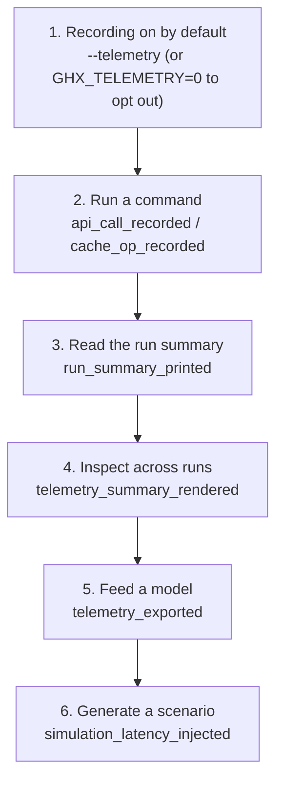

# Telemetry: Operational telemetry for API and cache performance

## Overview

This feature *is* the telemetry, so the measurement plan is about the events the tool records locally, not about product analytics.
The goals are to make per-call API and cache cost measurable, to make cache-population decisions answerable with data, and to feed measured latency distributions into the simulation generator.
Everything stays on the machine: ghx is offline-first by architectural decision (`.sdlc/context/architecture.md`, `.sdlc/features/FEAT-0008-sqlite-backend/telemetry.md`), so there is no analytics platform, no upload, and no user tracking.

## Success Metrics

| Metric | Target | Measurement Method | Timeframe |
|---|---|---|---|
| Per-call coverage | 100% of GraphQL calls and cache operations produce exactly one event when enabled | Count events and compare against the call count in a run | Every run |
| Overhead budget | Median instrumented duration < 1 ms above the uninstrumented median | `go test -bench` with and without the recorder | Per release |
| Failure isolation | 0 commands fail or slow because of telemetry | Run with an unwritable/locked database and compare behavior and exit code | Per run |
| Simulation fidelity | Generators can reproduce measured per-kind latency including the tail | Compare generated delay distribution against the recorded one | At model-fitting time |
| Egress | 0 network calls attributable to telemetry | Run against a recording mock server and inspect hosts | Per release |

## User Funnel

Not applicable in the product sense: there is no sign-up, activation, or retention funnel for a local developer tool.
The closest equivalent is the workflow the data enables, and it is rendered below because a broken or unreachable step is worth seeing at a glance.

| Step | Event | Entry Criteria | Exit Criteria |
|---|---|---|---|
| 1. Opt in | `telemetry_enabled` | The user enables telemetry | A recorder is constructed for the command |
| 2. Run a command | `api_call_recorded` / `cache_op_recorded` | The recorder is enabled | At least one event is queued |
| 3. Read the run summary | `run_summary_printed` | A `cache` run finished with telemetry enabled | The user sees per-kind durations and retry count |
| 4. Inspect across runs | `telemetry_summary_rendered` | A populated database exists | Rows per kind with counts and percentiles |
| 5. Feed a model | `telemetry_exported` | The database has events | A file or stream of events is produced |
| 6. Generate a scenario | `simulation_latency_injected` | A fitted latency model is supplied | The mock server delays responses per the model |

## Analytics Events

These are local events written to `telemetry.db`; they share the `telemetry_event` shape from the specification.

### `telemetry_enabled`

**Trigger:** When a command opens the recorder with telemetry enabled.
**Location:** `internal/telemetry` (recorder construction, wired from `cmd/root.go`).

| Property | Type | Required | Description |
|---|---|---|---|
| source | string | Yes | `flag` or `env`, indicating how telemetry was enabled |

### `api_call_recorded`

**Trigger:** Once per GraphQL call, after all retries for that call have finished or failed.
**Location:** `internal/github/client.go`, the single funnel in `Query`.

| Property | Type | Required | Description |
|---|---|---|---|
| source | string | Yes | Always `client` for this event |
| kind | string | Yes | Operation kind, e.g. `issue_full_fetch`, `pr_scan`, `pr_full_page` |
| operation | string | Yes | GraphQL operation name |
| host | string | Yes | API host |
| repo | string | Yes | `owner/repo` |
| status | number | No | HTTP status of the last attempt |
| duration_ms | number | Yes | Total duration, including backoff waits |
| page_size | number | No | Requested page size |
| cursor | boolean | Yes | Whether a pagination cursor was supplied |
| attempts | number | Yes | Number of attempts made |
| retried | boolean | Yes | `attempts > 1` |
| rate_remaining | number | No | `x-ratelimit-remaining` when present |

### `cache_op_recorded`

**Trigger:** Once per cache store operation when telemetry is enabled.
**Location:** `internal/cache`, in the `Store` decorator.

| Property | Type | Required | Description |
|---|---|---|---|
| source | string | Yes | Always `cache` for this event |
| kind | string | Yes | Operation kind, e.g. `cache_query_issues` |
| operation | string | Yes | Store method name |
| repo | string | Yes | `owner/repo` |
| backend | string | Yes | `sqlite` or `file` |
| duration_ms | number | Yes | Operation duration |
| items | number | No | Items read or written |
| failed | boolean | Yes | Whether the operation returned an error |

### `run_summary_printed`

**Trigger:** After a `cache` run completes with telemetry enabled.
**Location:** `cmd/cache.go`.

| Property | Type | Required | Description |
|---|---|---|---|
| source | string | Yes | Always `cache` for this event |
| total_ms | number | Yes | Total elapsed run time |
| calls | number | Yes | Total instrumented call count |
| retried | number | Yes | Calls that were retried |

### `telemetry_summary_rendered` / `telemetry_exported`

**Trigger:** When the read commands run.
**Location:** `cmd/telemetry.go`.

| Property | Type | Required | Description |
|---|---|---|---|
| source | string | Yes | `cli` |
| events | number | Yes | Number of events read |
| filtered | boolean | Yes | Whether `--kind`, `--repo`, or `--since` narrowed the set |

### `simulation_latency_injected`

**Trigger:** When a mock server starts with a fitted latency model.
**Location:** `internal/mockserver`.

| Property | Type | Required | Description |
|---|---|---|---|
| source | string | Yes | Always `mockserver` for this event |
| kinds | number | Yes | Number of operation kinds the model covers |
| samples | number | Yes | Total samples in the model |

## Counter Metrics

| Metric | Concern | Threshold |
|---|---|---|
| `pr_full_page` retry rate | GitHub secondary rate limit being tripped by concurrency | Above ~2% over a run |
| Event drop rate on flush | The queue overflowed or the sink is failing | Any drop while enabled |
| `telemetry.db` growth | Unbounded accumulation slowing reads | Investigate above roughly 100 MB |
| Median `duration_ms` per kind | Silent API regression | A sustained shift versus the last recorded baseline |

## Telemetry Requirements

| Requirement | Type | Notes |
|---|---|---|
| `telemetry.Recorder` with a disabled no-op implementation | Infrastructure | Constructed per command from the global `--telemetry` flag and `GHX_TELEMETRY`; injects into `github.Client` and the `cache.Store` decorator |
| Local SQLite database at `--telemetry-db` / `GHX_TELEMETRY_DB` / `$XDG_DATA_HOME/ghx/telemetry.db` | Infrastructure | Append-only; separate from the object cache so writes never contend |
| Bounded event queue plus a batched writer goroutine | Infrastructure | Guarantees no caller blocks on disk I/O (NFR-1, NFR-2) |
| `telemetry summary` | Dashboard / report | Per-kind counts, p50/p95, retry rate, and total bytes sent/received; the read surface for recorded events |
| `telemetry export --format json` | Event | Feeds the simulation fitter and the benchmark script |
| Post-`cache` timing summary on stderr | Report | Makes elapsed time and per-page breakdown visible after a run |
| Latency injection in `mockserver.Generate` | Infrastructure | Additive to `SimulationConfig`; consumes a fitted per-kind distribution |

## Dashboards and Alerts

- **Dashboard:** no hosted dashboard; `ghx telemetry summary` is the dashboard, and the exported JSON is the input for external plotting.
- **Alerts:** none.
  A CLI has no runtime to alert on; a regression is detected by comparing a benchmark or a summary against a recorded baseline.
- **Counter metric gate:** the retry rate per kind is the signal that matters most.
  A sustained `pr_full_page` retry rate above roughly 2% indicates GitHub's secondary rate limit is being tripped by the concurrency settings, and the correct response is to revisit `prBlocksInFlight` rather than to tune the algorithm on top of a degraded API.

## Out of Scope

- Remote or aggregated telemetry of any kind (forbidden by the offline-first constraint).
- User, machine, or usage identity of any sort.
- Automatic retention or pruning of the database; `telemetry clear --before` is manual.
- Analytics for other ghx features (issue listing, comment operations, stats reports).
